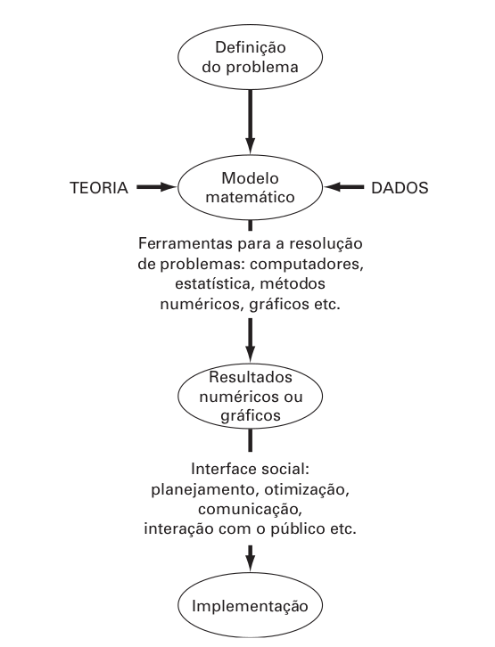
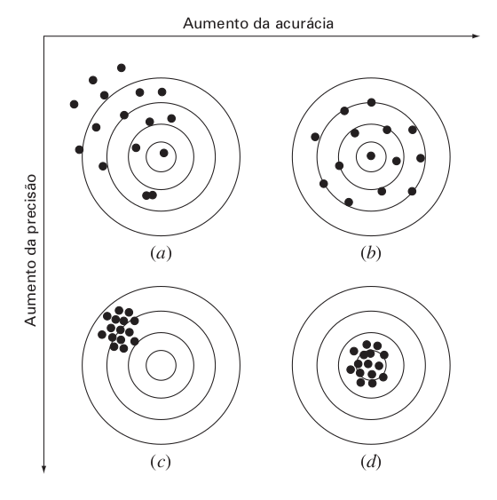
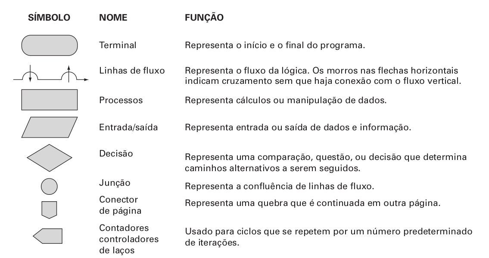

# 1. Intro

> Cálculo numérico ou métodos númericos é uma matéria/área que tenta achar soluções para as limitações dos computadores.

## Exemplo de uso:

- Em várias linguagens de programação, se você soma 0.1 dez vezes, o resultado ao invés de ser 1 sera 0.999999..., que é uma dizima periódica. **Metódos númericos** fornece o motivo e a solução para problemas desse tipo.
- Existem equações diferenciais impossiveis de se fazer na mão/papel. Através do calculo numérico e métodos de aproximação conseguimos encontrar valores com aproximações razoáveis
- Cálculo de integrais complexas em instantes
- Criação de modelos probabilisticos

## informações úteis:

- 
- 
- 

## python e numpy:

As anotações vão tentar ser o mais generalista possivel mas esse curso normalmente é feito com a linguaem python e usando a biblioteca numpy. Você pode tratar o numpy como o trabalho/resultado dos profissionais dessa matéria. numpy é grande, serve para várias coisas, até como base para outras bibliotecas.

Também é esperado que você tenha um conhecimento mínimo de matemática e saiba com implementar esses conceitos em código. Dessa forma, uma revisão básica sobre básica sobre python e numpy é bem vinda, mas não faremos isso aqui.

```python
#vc deve ser capaz de intender isso daq
import numpy as np

python_array = [[1,2,3], [4,5,6], [7,8,9]]
np_array = np.array([[1,2,3], [4,5,6], [7,8,9]])

R = np.random.rand(5,5)
print(R[0:3, 3:])

A = np_array
B = np.array([[-6, 7, 3]])
C = A@B.T
D =B.T@B
print(f"A x B = {C}")
print(F"B(transposta) x B = {D}")
print(C.shape)
```
