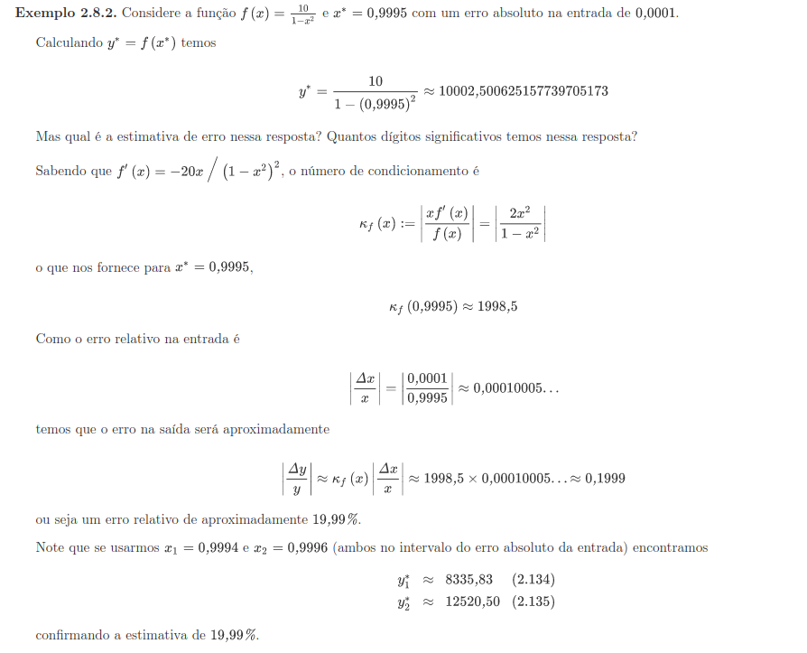

# 2. Aritmética de ponto flutuante:

Tudo que é armazenado/interpretado pelo PC (sistemas digitais no geral) precisam/estão no formato binário. Humanos trabalham com sistema decimal, computadores com o sistema binário.

Para passar um número decimal para binário você:

   1. Separa a parte inteira da fracionaria (se existir).
   2. Usa o método de **divisões sucessivas** por 2 (pois a base é binária) na parte inteira.
   3. Usa o método de **multiplicações sucessivas**, por 2, na parte fracionaria.
   4. junte as 2 partes por uma vírgula.

Para passar de binário para decimal você:

   1. indendtifica o digito de index 0 (1 digito a esquerda da virgula)
   2. multiplica cada digito por 2 (pois a base é 2) elevado à potencia do index do digito.
   3. Depois basta somar todos os valores

## Ponto flutuante normalizado:

De modo análogo a notação cientifica, o ponto flutuante normalizado é uma maneira deixar os números binários mais organizados. Consiste em deixar a parte inteira igual a zero, e o primeiro digito após a virgula diferente de zero. O número de digitos após a virgula é a **precisão** do sistema computacional, e a parte a direita da virgula é a **mantissa**.

### Sistema de Numeração - F(b,p,m,M):
   - Considere F uma maquina/PC. 'b' vai ser a base em que esse computador trabalha (decimal (10) ou binário (2), 'p' vai ser o número de digitos apos a virgula que ele suporta, 'm' é o menor expoente suportado e 'M' é o maior expoente suportando, ou seja, o menor valor que ele suporta é `b^(m-1)` e o maior é `(1-b^(-p))*b^M`.
   - Exemplo: **Escrever o número -3,625 no sistema F(2,5,-3,3)**:
     - 1 passo: passar para a base do sistema (nesse caso 2). -3,625 em binário é -11,101.
     - 2 passo: Normalizar esse número. Ficamos com (-0,11101 * 2^2)
     - 3 passo: verifique se o tamanho da mantissa é menor ou igual à mantissa da máquina (é igual então "cabe" no sistema)

### Aritmética de ponto flutuante:

   - Em computadores, a operação X\*(1/Z) é diferente de X/Z. No primeiro caso você está realizando 2 operações e é possivel que ocorra perca de dados/informação.
   - No geral, desde que os números estejam escritos na forma "normalizada" as operações são feitas da seguinte forma:
     - Multiplicação: Multiplica-se as mantissas e somam-se os expoentes
     - Divisão: Divide-se as mantissas e diminuem-se os expoentes
     - Soma e Subtração: Igualam-se os expoentes e então Soma-se/subtrai-se as mantissas

### **Arredondamento** x **Truncamento**:
   1. Arredondamento: É o problema/erro relacionado à impossibilidade de representar o número em binário/digitalmente. Se o ultimo digito é maior igual à cinco você arredonda para cima, e o contrario, para baixo.
   2. Truncamento: É o problema/erro de representação do resultado que ocorre quando tentamos aproximar uma soma matematica infinita para um procedimento finito. Quando te pedem para truncar, siginifica para cortar as casas decimais apartir do 5 digito.
   3. **erro absoluto** = módulo do (valor esperado - valor obtido)
   4. **erro relativo** = erro absoluto/valor esperado
   5. Todos os sistemas trabalham dentro de um intervalo de valores. Se algum número está abaixo desse intervalo ocorre um _underflow_ e se estiver acima ocorre um _overflow_.

### Cancelamento catastrófico
    1. É quando o sistema/linguagem 'arredonda' um valor numérico seja porque a mantissa é muito grande ou porque o número é dizima.
    2. Quando ocorre um cancelamento catastrófico, os valores das subsequentes operações apresentaram erros muito grandes. Ex: a = 2^(1/2); b = a^2; b-2 != 0;

### Propragação de Erros:
    1. Você faz uma operação, ela tem um erro de arredondamento. Faz outra, mais um errinho, e assim vai. O erro relativo vai aumentando a medida que as operações são feitas.
    2. Um dos artificos matemáticos mais importantes e fortemente utilizados em calculo numérico são as **séries de taylor** e suas aplicações.
    3. Dada f(x), podemos fazer com taylor:
       - Δy = f'(x)\*Δx
       - K(x) = x\*f'(x)/f(x)
       - Δy/y = K(x)Δx/x

